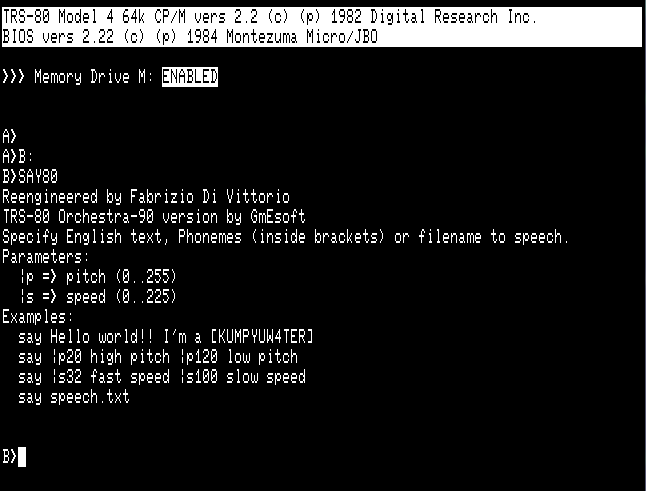
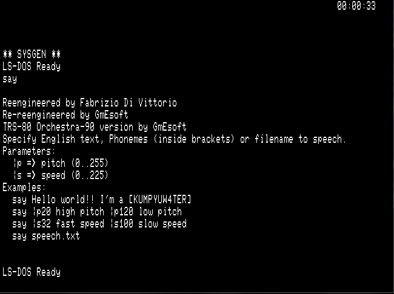

Say
===

S.A.M.-based text-to-speech voice synthesizer
---------------------------------------------

This is a S.A.M.-based text-to-speech voice synthesizer for CP/M and LS-DOS 6.3. Adapted to work on the TRS-80 
Model 4(p) with the Orchestra-90 sound adapter.

Based on SPEECH.COM for Bondwell 12/14, and on an improved version SAY.COM by Fabrizio Di Vittorio, it has been 
further reworked to reduce the size of the binary executable, and to port it to TRS-80 Model 4 with Orchestra-90 
running on CP/M or LS-DOS 6.3.

Plan to make a terminate-and-stay-resident version.

To be assembled using ZMAC by [George Phillips](http://48k.ca) (http://48k.ca/zmac.html). Produces a core-image-file that will be 
loaded by CP/M at 0100H, or a /CMD file that will be loaded by LS-DOS 6.3.

Based on the works by [Fabrizio Di Vittorio](https://github.com/fdivitto) (https://github.com/fdivitto/SAY).

The following text is taken from his repository.

> Bondwell 12/14, reverse engineering and improvements of SPEECH.COM
> 
> Here is progresses performing reverse engineering of Bondwell 12/14 SPEECH.COM program. After disassembling it I have added some new features, like speech directly from command line, singing and speech speed.
> 
> Now you can write something like:
> 
> `SAY Hello World!`
> 
> Text is normally interpreted as English. Text inside `[...]` is interpreted as Phonemes.
> 
> `|p` sets the pitch (0..255), 0=high, 255=low, default is 64. For example `say |p27 hello`. A space must follow pitch setting.
> 
> Multiple pitches can be specified. ie: `say |p20 hello |p50 world |p90 fab`
> 
> `|s` sets the speed (0..225), 0=fast, 225=slow, default is 72. For example `say |s30 slow speak`. A space must follow speed setting.
> 
> Multiple speeds can be specified and mixed with picthes.
> 
> `|m1` enable song mode.
> 
> `|m0` disable song mode.
> 
> If the specified text represents a file it is loaded and spoken. File may contain parameters like `|s`, etc... Example:
> 
> `say mytext.txt`
> 
> You can find original SPEECH.COM inside first system disk (CP/M) of Bondwell 12/14 and 16.
> 
> Phonemes and almost all tables are the same of SAM (Software Automatic Mouth), a very popylar Text-To-Speech program running on Apple II and Commodore 64. Large parts of code are directly converted to Z80 code from 6502 code. I don't know if Bondwell was ever authorized by the author of SAM to do this.
> 

### See also:

- https://github.com/DLehenbauer/c64-sam.git for a reverse-engineered source code of S.A.M. for Commodore 64, 
  done by [Daniel Lehenbauer](https://github.com/DLehenbauer);
- https://github.com/s-macke/SAM.git for a re-implementation of S.A.M. in the C language, done by 
  [Sebastian Macke](https://github.com/s-macke).

Both projects have also been helpful to this project.
